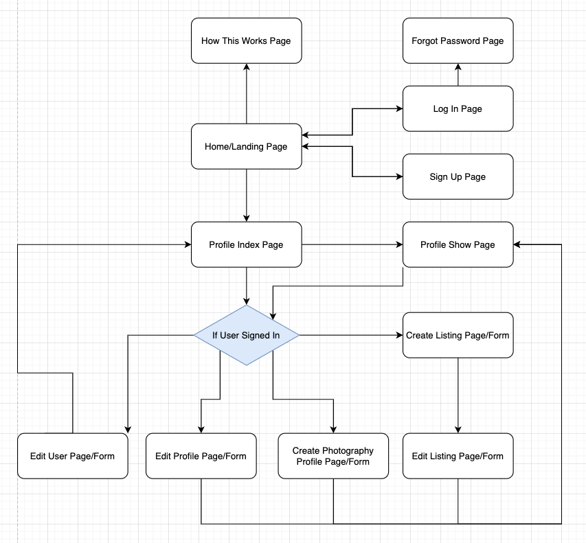

# PhotoPlace
by Tyler Hall

## The one-stop-shop for all your Photography needs!

My Depolyed App - [https://fathomless-oasis-65004.herokuapp.com/](https://fathomless-oasis-65004.herokuapp.com/ "PhotoPlace Marketplace")  
Link to my GitHub Repo - [https://github.com/Impicklerick12/PhotoMarketplace](https://github.com/Impicklerick12/PhotoMarketplace "Marketplace App GitHub Repo")

### Why should an app exist for this?
PhotoPlace was developed out of a need for people searching for photographers, but also photographers looking to advertise their work and provide listings for the services and products they provide. In my previous experience as a freelance photographer, it was hard to find consistent work. The process of marketing can feel pointless at times, and what mediums are best for self-advertising? On the other hand, it is also difficult to find an experienced photographer without having to sift through multiple google search pages, instagram profiles and more. It would be a lot easier if photographers and customers alike were about to connect on the one platform, which is what PhotoPlace aims to do.

##### Purpose
PhotoPlace aims to connect photographers and customers. It’s purpose is to solve two common problems when acquiring photography services, the difficulty in finding an appropriate photographer, and on the other side of the coin, the difficulty in finding work for freelance photographers. PhotoPlace allows photographers to post ‘listings’, which can be any form of service they wish to provide, such as a portrait photography session, a workshop or even a piece of art. Instead of shopping and browsing across a variety of apps and websites, PhotoPlace is a one-stop-shop for photography services. Users are able to search for specific types of listings, instead of having to ask a photographer what their rate is for a certain service, it can be laid out in the form of a listing with a set price. 

##### Functionality / features
PhotoPlace allows users the choice to create a profile if they wish, which represents a photographer's profile page. If they are simply browsing and are looking for a photographer to work with, they do not need to and can still perform actions on the site. Users are only able to create one profile, which can contain information about themselves and their professional photography experience such as their name, social media links and a bio. Profiles are able to create many listings, which are essentially products or services that the photographer provides. These listings are editable only by the profile user, and contain information relevant to the service such as the description, category of service, and price. Within each profile page (show page), there is a reviews section at the bottom. This was created so that users and photographers alike were able to leave comments and reviews about profiles, giving real feedback regarding the quality of work that the photographer provides. Finally, there is an area where all of the listings are provided, so that any user is able to filter through them to find their desired category or service. 

##### Target audience
PhotoPlace is initially targeted at photographers looking to display their professional profiles and services. The appeal of PhotoPlace is a one-stop-shop for photographers, instead of having to use several different services and apps to provide information and advertising to potential clients. PhotoPlace relies on photographers creating detailed profile pages, and populating them with listings containing the services they provide. The second target audience is the general population who are searching for photographers to work with, searching for services such as product or wedding photography. This audience is able to interact with photographers, view their services, and leave reviews relating to their experiences. When PhotoPlace grows, it could accommodate a number of creative services such as videography, graphic design, and even software development.

##### Tech stack
PhotoPlace is a web app built using a variety of technologies, including a server-side framework, front-end css framework and various ruby gems. The full list includes:

* Ruby on Rails

Server-side web application framework written in the Ruby language. Utilizes a MVC framework.

* PostgreSQL

Open-source relational database management system. Flexible and compliant, built on the SQL language. 

* HTML5

* Bulma 

Open-source CSS framework based on flexbox. Uses universal class names and html syntax to create elements for a web page. Easy to use framework with intuitive class names made it super easy to create a great looking site. Also incorporates Font Awesome for remote access to icons that can be used site-wise.

* SCSS(SASS) 

Elements styled using SCSS, a CSS preprocessor. Utilized partials and universal variables to minimize written and inline CSS.

**Ruby Gems**
* Devise - User authentication
* AWS S3 - Amazon Web Services object storing service for image uploading
* Bulma - CSS framework
* Fake - Use fake information such as names and emails to populate the database

##### Sitemap

##### Wireframes

###### Landing Page

###### New Listing Page

###### Profile Show Page

###### Profiles Index Page

###### Sign Up/Log In Page

##### Screenshots

##### Task Management

## Data Structure
##### Entity Relationship Diagram
  

##### The Relations

The relations in PhotoPlace are represented in the Entity Relational Diagram above, which is a visual representation of the database tables in my PostgreSQL relational database, and how each relates to the others. Each table has a title, eg. User, and comprises of several columns that are populated with data each time that corresponding form is completed on the app. The tables contain a primary key, typically represented by the table ID. Any other tables that need to reference another table utilise a foreign key as their input for a column. This is described in the Profile table, which has a user_id column which is a foreign key connecting it to the primary key of the User table. 

My application was designed so that everyone who signs up to PhotoPlace is a user, and each user has the option to create a photographers profile if they wish to advertise their services. Each user is only able to create one photographer profile, as there is no reason for a user to create more than one. This was achieved through the active record relations, making a correlation between the current_user.id and the profile.id, and also some user verifications in my views and my profile controller. I created some helper methods to determine if they current user had created a profile (Profile.exists?) and if true, then the verifications would prevent them from creating any new profiles by redirecting them back and providing an error message. The same verifications allowed me to customize the buttons in the nav bar, to prevent the “Create Profile” button from showing.

Once this was achieved, my next relation involved a profile being able to create multiple listings. Each user has the ability to create many listings (has_many), and subsequently each listing must belong to one profile, referencing their ID. 

Each profile also has many reviews, which in turn belong to only one profile. These reviews are associated to only one profile, and contain information regarding the body of the comment/review, and references to the profile ID and the user ID that placed the review. 

Lastly, each listing that is created has relations to multiple entities, such as the profile that created it and to a category that it belongs in. A listing is referenced to the profile ID that it belongs to, and similarly to a category ID referencing which type of category.  

##### The Models
Rails uses Active Record associations to create the relationships between different models. These associations enable us as developers to specify how each model is related, and also the extent to how they are related. 

In my Rails application, my **User** model was created through the use of the Devise ruby gem, which is designed for user authentication. A user is created when someone signs up to the app with an email and password. My User model includes Active Record associations that allow them to create one Profile (has_one :profile), and also create many reviews on any profile that they wish (has_many :reviews). Both associations include dependent: :destroy, which will remove any associations that are attached to that model if it is deleted. This will ensure that there are no orphaned records in the database.

The Active Record associations in my **Profile** model include belongs_to User, creating a connection between the profile model and a user ID. Next the association has_one_attached is related to a photo, which is stored within Active Storage in Rails. When setting up image upload, Active Storage is installed on rails, and helper methods are created to include a file upload field in forms, then a variable :photo can be attached to it, which connects the uploaded file to the profile when permitted in the params. The next Profile model association is in connection to the Listings model, has_many :listings, dependent: :destroy. This made the association that any profile can have many listings, and if the profile is to be deleted, then their listings would also be destroyed. The final association, which is the same relationship as with the listings, is has_many :reviews, dependent: :destroy. This allows the profile to contain many reviews, which independently have their own reference with a user ID.

Inversely, my **Listing** model belongs_to :profile, and also belongs_to :category. This completes the association between the models, ensuring that the listing data entry cannot be orphaned if it is associated with a model with a dependent destroy attachment.

My **Category** model only has one association, which is has_many :listings. This means that any one category can be used across multiple listings.

Finally, my **Review** model includes the belongs_to association with my User and Profile models. This association allows the connection with a profile, which is where the reviews will be displayed, and also to the user who is placing the review. The last association is validates :review, presence: true, allow_blank: false. This association validates that the associated object is present, and also that the provided text field for the review cannot be left blank and submitted. 

## User Stories
* Users can create an account
    * Users can edit email and password

* Users can sign up, log in and log out
    * Users can stay signed in on their selected browser
    * Users can delete user account

* Users can view all profiles, listings and  reviews

* Users can write reviews on profile pages

* Users can create a photographer profile
    * Profile can contain a name, description, profile photo and social media links

* Profiles can create listings
    * Listings contain information such as a title, description, price and category

* Profiles are only able to edit and delete their own profile and listing information
* Profiles are able to leave reviews on other profile pages

## Other Stuff
### Third Party Services

* **Github** 

Cloud based storage and hosting for software development, incorporating version control.

* **Heroku**

Container-based cloud platform used to deploy, manage and host web apps. Free service for smaller projects like this one, easy to use through the command line and Git integration.

* **AWS S3**

Cloud hosting service for image storing.

### High Level Look at Various Components
Lorem ipsum dolor sit amet, consectetur adipisicing elit, sed do eiusmod tempor incididunt ut labore et dolore magna aliqua. Ut enim ad minim veniam, quis nostrud exercitation ullamco laboris nisi ut aliquip ex ea commodo consequat. Duis aute irure dolor in reprehenderit in voluptate velit esse cillum dolore eu fugiat nulla pariatur. Excepteur sint occaecat cupidatat non proident, sunt in culpa qui officia deserunt mollit anim id est laborum.